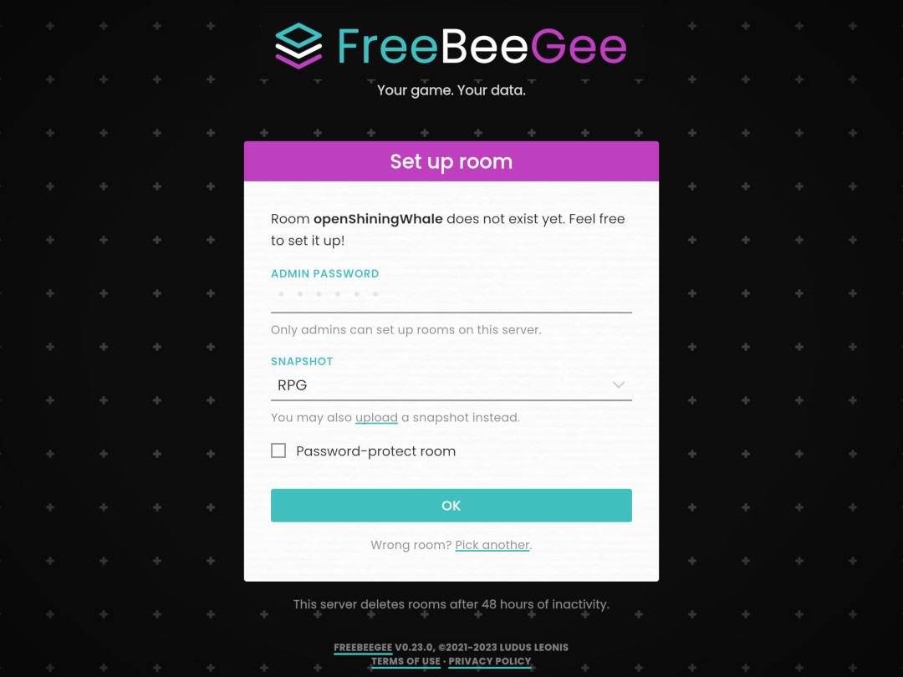

  

# FreeBeeGee

A virtual gaming tabletop you can host on your own server.

Your game. Your data.

[FreeBeeGee Homepage](https://freebeegee.org/) | [GitHub](https://github.com/ludus-leonis/FreeBeeGee) | [Patreon](https://www.patreon.com/LudusLeonis)

## Key features

* Browser-based 2D virtual tabletop for board- and role-playing games.
* Easy-to-use drag'n'drop interface. Keyboard hotkeys for power-users.
* Invite friends by sending them a table's unique URL.
* Tile-/grid-based, with snapping. Classic dungeon tiles and 200+ monster token included.
* Separate layers for tiles, overlays and tokens.
* Asset browser for your token/tiles. Individual libraries per game.
* Sticky notes and dice trays.
* Subtable support to easily switch between game setups or dungeon levels.
* Templates to setup tables and populate your library from.
* Transfer individual tables between servers. Or keep an offline backup.
* Privacy friendly. No user tracking. No 3rd-party scripts. Tables are deleted after some (configurable) time, usually 48h.
* File & folder-based. No database required.
* Easy to install and maintain.
* Open source software (AGPL-3.0). Server/API written in PHP, client in JavaScript.

**Note:** This is still an early/development version. A few rather major features are still missing, limiting it's current usefullness:

* While you can upload images/tiles/pieces via the web-UI, editing them is quite limited.
* No per-table passwords yet. Anyone who knows a table name can join. That is partly by design, but it would be nice to have that option.
* You can attach (text)labels to tokens, but no fancy state-icons, HP counters etc. - yet.

The good news is: You can still use FreeBeeGee today to play! Missing features will arrive sooner or later. There is a [roadmap](docs/roadmap.md) for details.

## Screenshots

## What FreeBeeGee is not

FreeBeeGee follows the [KISS principle](https://en.wikipedia.org/wiki/KISS_principle). It is not intended to be:

* Your group's text/voice/video chat solution.
* A game scripting engine or programming environment.
* An AI to play against.
* A 3D or physics engine with dazzling visual effects.
* A community management tool.
* A campaign management tool.

There is also a [FAQ](docs/FAQ.md) explaining some of the technical decisions/limitations of this project.

## Requirements

### Server

* PHP 7.3 / 7.4 / 8.0 with `zip` extension
* Apache with `.htaccess` / `mod_rewrite` support

### Client

Any recent HTML5-capable browser should do. No IE, sorry. Mobile/touch device support is also a bit limited for now.

## Installation

Download the latest release from [https://github.com/ludus-leonis/FreeBeeGee/releases](https://github.com/ludus-leonis/FreeBeeGee/releases). Extract the `*.tar.gz`/`*.zip` into a folder on your web-server and you are (almost) ready to go - FreeBeeGee comes with reasonable, secure defaults.

Read the [Setup & Config](docs/INSTALL.md) docs for details.

## License

[GNU AGPL-3.0](LICENSE.md)
