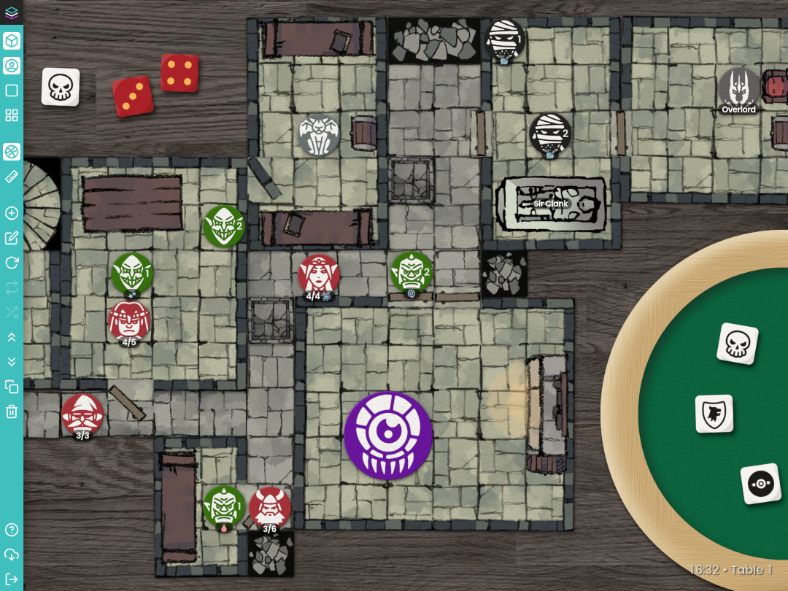

  

# FreeBeeGee

A virtual gaming tabletop you can host on your own server.

Your game. Your data.

[FreeBeeGee Homepage](https://freebeegee.org/) | [GitHub](https://github.com/ludus-leonis/FreeBeeGee) | [Patreon](https://www.patreon.com/LudusLeonis) | [Docs](docs/DOCS.md)

## Key features

* Browser-based 2D virtual tabletop for board- and role-playing games.
* Easy-to-use drag'n'drop interface. Keyboard hotkeys for power-users.
* Invite friends by sending them a room's unique URL. Room passwords optional.
* Multiple tables per room. Use them for different game setups or dungeon levels.
* Tile-/grid-based. Supports square and hex layouts, with snapping.
* Classic game boards, dungeon tiles and 200+ monster token included. Upload your own, too.
* Separate layers for tiles, overlays and tokens.
* Asset browser for your token/tiles. Individual libraries per room.
* Sticky notes and dice trays.
* Templates to setup tables and populate your library from.
* Download snapshots of your rooms, transfer them between servers or keep an offline backup.
* Privacy friendly. No user tracking. No 3rd-party scripts. Rooms are deleted after some (configurable) time, usually 48h.
* File & folder-based. No database required. Easy to install and maintain.
* Open source software (AGPL-3.0). Server/API written in PHP, client in JavaScript.

**Note:** This is an development version. A few rather major features are still missing:

* While you can upload images/tiles/pieces via the web-UI, editing them afterwards is quite limited.

The good news is: You can still use FreeBeeGee today to play! Those features will arrive sooner or later. There is a (rough) [roadmap](docs/roadmap.md) for details.

## Screenshots

## What FreeBeeGee is not

FreeBeeGee follows the [KISS principle](https://en.wikipedia.org/wiki/KISS_principle). It is not intended to be:

* Your group's text/voice/video chat solution.
* A game scripting engine or programming environment.
* An AI to play against.
* A 3D or physics engine with dazzling visual effects.
* A campaign/game management tool.
* A community management tool.

## Requirements

### Server

* PHP 7.4 / 8.0 / 8.1 with `zip` extension
* Apache with `.htaccess` / `mod_rewrite` support

-- or --

* Docker

### Client

Any recent HTML5-capable browser should do. Mobile/touch device support is a bit limited for now, but should be good enough for spectators.

## Installation

Read the [Setup & Config](docs/INSTALL.md) docs for full install instructions and how to set your mandatory server password.

## License

[GNU AGPL-3.0](LICENSE.md)
