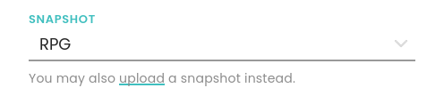

# Troubleshooting & HowTo

Here are a few common issues and possible solutions:

## I get 'Internal Server Error'!

If you get an *Internal Server Error* page after installation and you use the basic (default) `.htaccess` file: Apache's module `mod_rewrite` is not enabled on your httpd server - either not in general or not for your domain/folder. How to enable it depends a bit on your server/hoster, so please check your Apache configuration file or the web admin tool of your provider.

If you get this after editing the `.htaccess` file yourself: There is probably a syntax error or you tried enabling an Apache feature not supported by your web server. Please check and revert your changes.

## I get 'Our server is currently experiencing technical difficulties'!

This is a bit tricky to diagnose as it can different reasons. Doublecheck if you have all required Apache and PHP modules/extensions installed that are listed in the [install instructions](INSTALL.md).

Here are a few things you can try:

* Check the file permissions on the server as mentioned in the [install instructions](INSTALL.md).
* Take a look into Apache's `error.log`. It might complain about missing extensions/modules. If so, you need to install those.
* Open the browser console (press F12) and switch to the Network tab. There sould be a line that says `/api`. Select it and view the server response/reply (raw/source). There might be errors about missing extensions/modules hidden there.

## I don't know my admin password!

You have to set a password first (or disable it). See the [install instructions](INSTALL.md).

## How do I use snapshots?

A snapshot is a `*.zip` file (a.k.a. savegame or backup) of your room. You can obtain it by using the download icon on the bottom left in a room. You can use it to continue your game on the same or a different server - if the other server's admin enabled snapshot uploads. See the [install instructions](INSTALL.md) how to do this.

If snapshot upload is enabled on a server, you will see the sentence *You may also upload a snapshot instead* below the snapshot dropdown:

If you click on *upload*, the input field will change into a file upload:

Assuming your snapshot is not too big, it will be used for this room. It will be also auto-converted to the current FreeBeeGee version.

## Why does FreeBeeGee reject larger snapshots?

This can have multiple reasons. Hover over the (?) icon of the error message to find out why.

* Your webserver might limit upload sizes. Check your httpd.conf. Managed web hosters might also have an option for that in their web console.
* PHP might limit uploads. Check your php.ini. Managed web hosters might also have an option for that in their web console.
* `.htaccess` might limit uploads. Check your `.htaccess` either in the root of your webserver or in the root of FreeBeeGee.
* FreeBeeGee might limit uploads. Check your `api/data/server.json` to increase the limit.

## How do I permanently install snapshots?

You can install any snapshot on your server, avoiding the need to upload it during room create. Snapshots are just `*.zip` files with pre-configured assets and table layouts. You can obtain a snapshot by downloading it from any room you have joined via the icon on the bottom left.

* Rename the `*.zip` file to something meaningful, e.g. `Dungeon.zip` or `Chess.zip`. Snapshot filenames can have most chararacters including dashes, underscores and spaces, but except: <, >, ", &
* Copy the renamed file into `.../api/data/snapshots/`.

Now *Dungeon (custom)* or *Chess (custom)* should appear in the snapshot drop-down when you set up new rooms.

In case the snapshot was from a different FreeBeeGee version, it will be converted each time you set up a room with it. To avoid having to do this every time, save a new snapshot after opening the room, and repeat the steps above with the new `*.zip`.

## How can I create my own custom game snapshot?

You can create custom game snapshots from scratch, too. Just create a `*.zip` file that follows the [FreeBeeGee snapshot format](snapshots.md). You can then upload your zip like any other snapshot, or install it permanently on the server (see above).

## Why are pieces missing after converting a snapshot?

This happens when uploading older snapshots that use features that changed or were removed. Most of the time your library should be fine, but pieces on the table might be replaced with placeholder X'es. These X'es are a hint what is missing now. Delete them from the table and add the pieces again, or empty the table and start from scratch.

## How can I report bugs?

Please help making FreeBeeGee better by reporting bugs you encounter!

To file a bug report or feature request, please use the [issue tracker on GitHub](https://github.com/ludus-leonis/FreeBeeGee) and provide the following information:

* What did you do (e.g. *I right-clicked on X* or *I pushed key o*).
* What did you expect to happen (e.g. *The popup window should appear where I clicked*).
* What actually happened (e.g. *The popup window appears, but the lower part is cut off.*).
* The FreeBeeGee version you are using.
* Your Apache + PHP version.
* Your browser + operating system version.
* In case you get error messages, please include the complete, original message.
* If you have setup/Apache problems, please also post any related error messages found in your web server's `error.log`.

For visual bugs a screenshot can be helpful, too.
